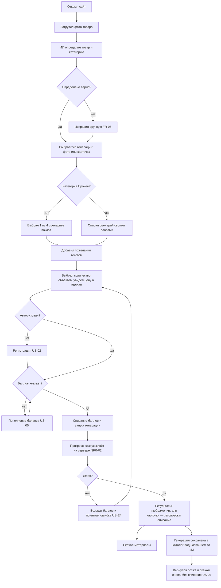
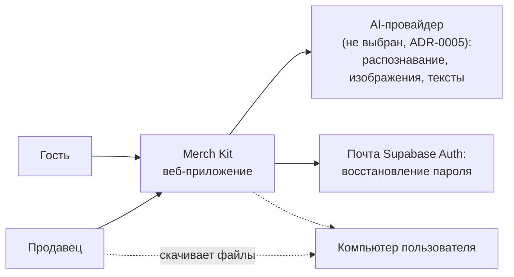
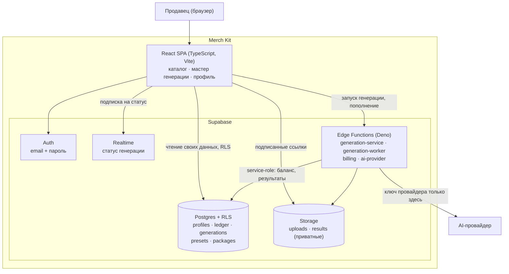
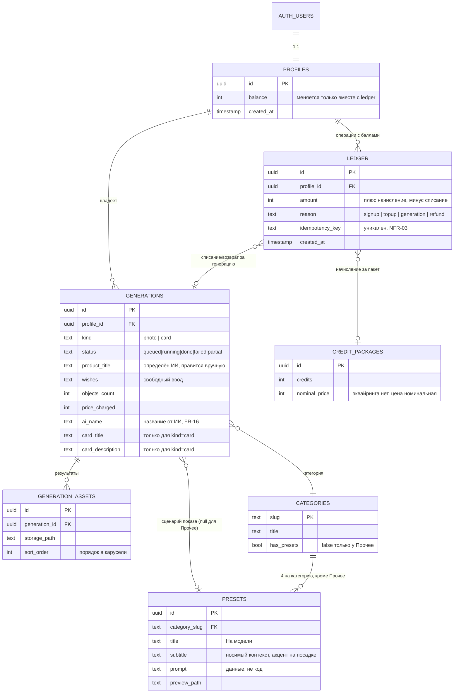
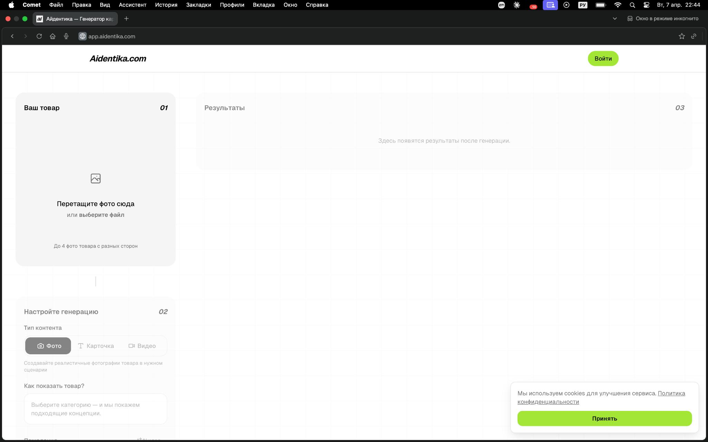
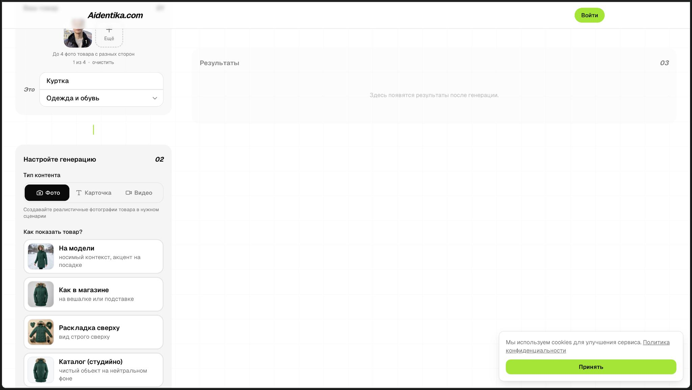
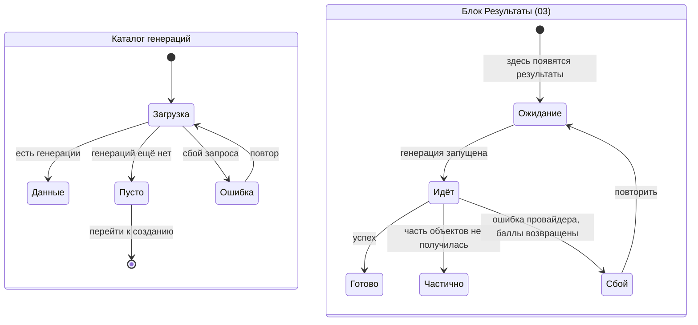
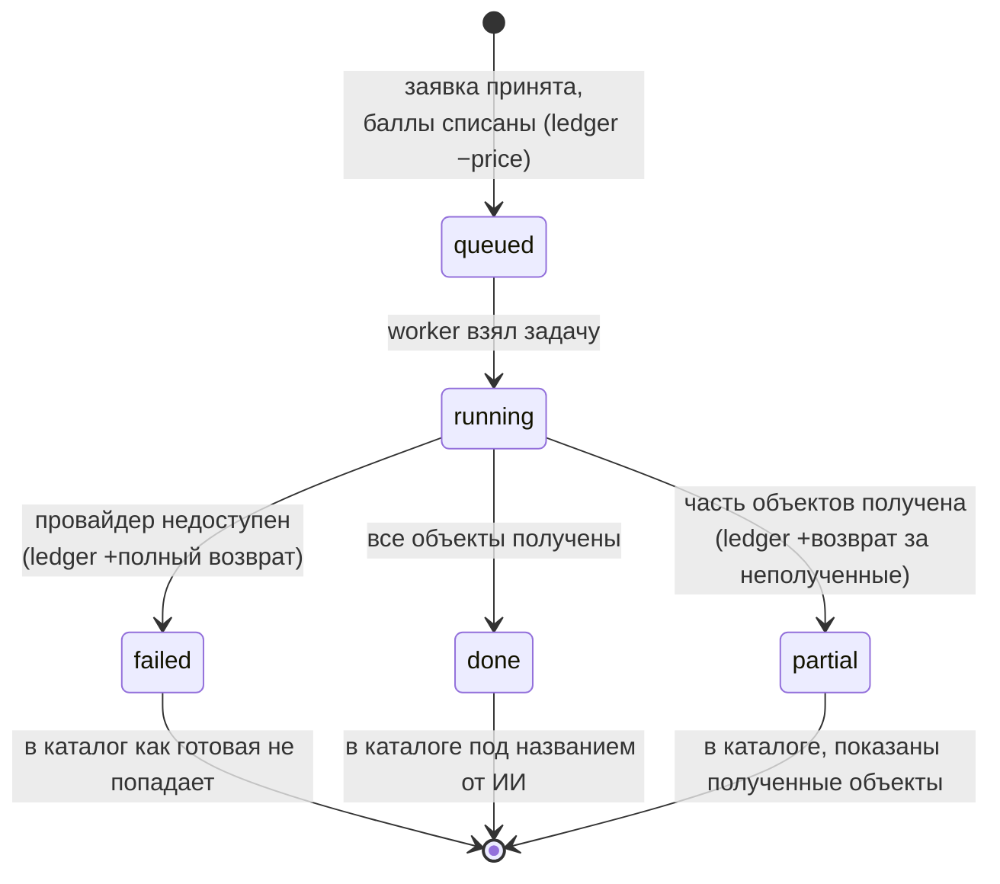

# VISUALS — визуальный артефакт проекта

Status: DRAFT (черновик интейка от 2026-08-26) · Слой: **как это выглядит и как связано**

> ## ⚠ Правило единственности — читать до правки
>
> **Это единственный визуальный артефакт проекта.** Все схемы, диаграммы, скриншоты
> референсов и макеты живут здесь и больше нигде.
>
> - Файл **переписывается на месте**. Файлов `VISUALS_v2.md`, `VISUALS_old.md`,
>   `СХЕМЫ.md`, `SPEC_диаграммы.md` **не существует** и заводить их запрещено.
> - `TZ.md` и `SPEC.md` на визуалы **ссылаются** (`[V-03](VISUALS.md#v-03)`), а не копируют их.
> - **Правка визуала обновляет и визуал, и все ссылающиеся на него пункты** — в одном
>   изменении. Список ссылающихся держится в реестре ниже.
> - У каждого визуала **стабильный ID `V-NN`**. ID не переиспользуется после удаления.
> - **Схемы — текстом (Mermaid), не картинкой.** Картинками остаётся только то, что картинкой
>   и является: скриншоты, фото, макеты.
>
> Обоснование — [ADR-0004](adr/0004-single-visual-artifact.md).

**Как адресовать правку:** «на схеме V-03 добавь шаг X» / «референс V-05 больше не берём».

---

## Реестр визуалов

| ID | Название | Тип | Что показывает | Ссылаются |
| --- | --- | --- | --- | --- |
| [V-01](#v-01) | Главный сценарий | Mermaid flowchart | Путь продавца от загрузки фото до скачанных материалов | `TZ.md` US-01 |
| [V-02](#v-02) | Контекст системы | Mermaid (C4 L1) | Merch Kit и внешний мир | `SPEC.md` §1 |
| [V-03](#v-03) | Контейнеры | Mermaid (C4 L2) | Из каких частей состоит система | `SPEC.md` §1, §3 |
| [V-04](#v-04) | Модель данных | Mermaid ER | Сущности и связи | `TZ.md` §7, `SPEC.md` §4 |
| [V-05](#v-05) | Референс aidentika.com | Скриншоты + разбор | Что берём и что не берём из референса | `TZ.md` §1, §5.1, `SPEC.md` §9 |
| [V-06](#v-06) | Состояния экранов | Mermaid state | Загрузка · пусто · ошибка | `TZ.md` §4 |
| [V-07](#v-07) | Жизненный цикл генерации | Mermaid state | Статусы генерации и движение баллов | `SPEC.md` §1, `TZ.md` US-E4, US-E5 |

---

## V-01 — Главный сценарий

Что показывает: путь продавца (`TZ.md` §2) через главный сценарий US-01.

## V-02 — Контекст системы (C4 уровень 1)

## V-03 — Контейнеры (C4 уровень 2)

> **Красная линия на схеме:** от `UI` к `AIP` стрелки нет и быть не может — ключ провайдера
> в браузер не попадает (`SPEC.md` §3, `TZ.md` §8).

## V-04 — Модель данных

> TODO(пользователь): поля `credit_packages.credits` и прайс генерации пока без значений —
> см. открытые вопросы `TZ.md` §11.

## V-05 — Референс aidentika.com

> Каждый референс — с разбором. «Хочу как у них» без разбора превращается в копирование
> случайных решений, включая их ошибки.

### V-05.1 — Стартовый экран: три колонки

- **Что это:** [app.aidentika.com](https://www.aidentika.com/), скриншот из ТЗ заказчика
- **Скриншот:** ``

- **Берём:**
  - трёхшаговую раскладку с явной нумерацией: **01 Ваш товар** → **02 Настройте генерацию**
    → **03 Результаты**. Пользователь видит весь путь целиком, а не узнаёт о следующем шаге
    после нажатия;
  - зону drag-and-drop как главный вход («Перетащите фото сюда · или выберите файл»);
  - подсказку про несколько ракурсов («До 4 фото товара с разных сторон») — из неё взято
    предположение о 4 фото, см. открытый вопрос в `TZ.md` §11;
  - пустое состояние правой колонки с текстом «Здесь появятся результаты после генерации»
    вместо пустоты (`TZ.md` §4, [V-06](#v-06)).
- **Не берём:**
  - вкладку **«Видео»** в «Тип контента» — по нашему ТЗ типов ровно два, «фото» и
    «карточка» (`TZ.md` §3, не-scope);
  - конкретный визуальный стиль (салатовый акцент, шрифты) — фирменный стиль наш,
    > TODO(пользователь): есть ли брендбук / палитра.

### V-05.2 — Распознавание и сценарии показа

- **Скриншот:** ``

- **Берём:**
  - блок **«Это»**: распознанное наименование («Куртка») отдельным полем + категория
    («Одежда и обувь») выпадающим списком — оба **редактируемые** (обоснование FR-05);
  - счётчик загруженных фото «1 из 4 · очистить»;
  - карточки сценариев показа: **превью + название + короткое пояснение** — именно
    пояснение делает выбор осмысленным для того, кто не умеет писать промпты. Отсюда взяты
    четыре сценария категории «Одежда и обувь» (`TZ.md` §5.1):
    «На модели» — носимый контекст, акцент на посадке ·
    «Как в магазине» — на вешалке или подставке ·
    «Раскладка сверху» — вид строго сверху ·
    «Каталог (студийно)» — чистый объект на нейтральном фоне.
- **Не берём:** ничего дополнительно.

> TODO(пользователь): нужны такие же формулировки для остальных пяти категорий со
> сценариями (Аксессуары, Еда и напитки, Косметика и уход, Гаджеты и техника, Дом и мебель)
> — итого 20 недостающих из 24.

## V-06 — Состояния экранов

## V-07 — Жизненный цикл генерации и движение баллов

Что показывает: как статус генерации связан со списанием и возвратом баллов
(`SPEC.md` §1, §3; `TZ.md` NFR-03, US-E4, US-E5).

> Каждая запись в `ledger` несёт ключ идемпотентности: повторная доставка одного события не
> двигает баланс дважды (NFR-03).

---

## Изображения

Бинарники — в [`assets/`](assets/), имя файла привязано к ID визуала:
`v-05-1-<slug>.jpg`. Так по имени файла видно, к какой схеме он относится.

Форматы: PNG/JPG для растра, SVG для векторных макетов. Крупные исходники (Figma, PSD) в
репозиторий не кладутся — вместо них ссылка + экспортированный скриншот.

## Как править

1. Найти визуал по ID (`V-NN`).
2. Поправить его **здесь**, на месте. Не создавать копию, не заводить второй файл.
3. Обновить строку реестра, если изменилось назначение схемы.
4. Пройти по колонке «Ссылаются» и синхронизировать пункты в `TZ.md` / `SPEC.md` —
   **в том же изменении**.
5. Если правка меняет требование, а не только картинку, — правится и требование в `TZ.md`.

## Связанные документы

| Документ | Что там |
| --- | --- |
| [`TZ.md`](TZ.md) | Требования — что и зачем |
| [`SPEC.md`](SPEC.md) | Спецификация — как устроено |
| [`adr/0004-single-visual-artifact.md`](adr/0004-single-visual-artifact.md) | Почему визуальный слой — один файл |
