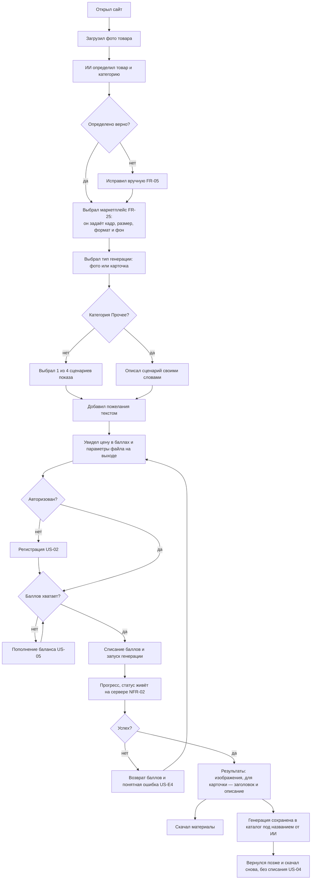
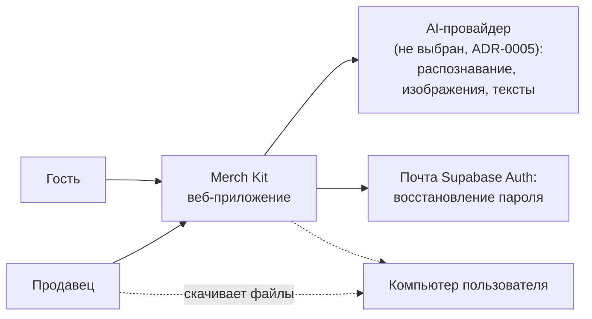
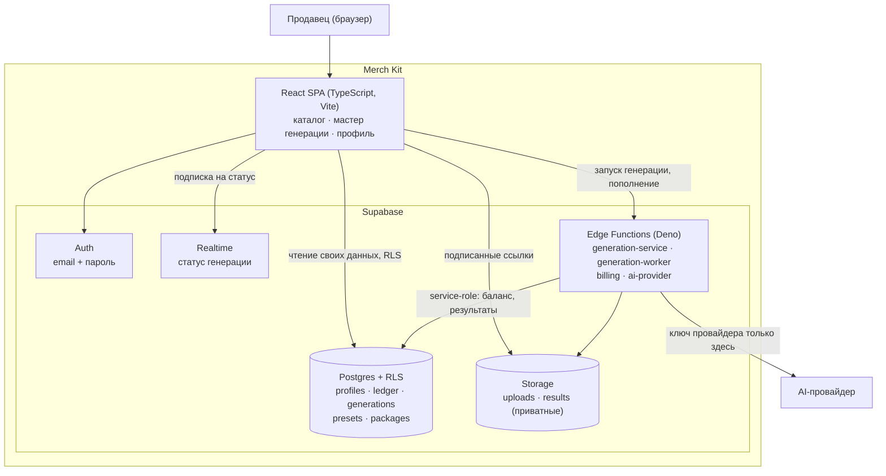
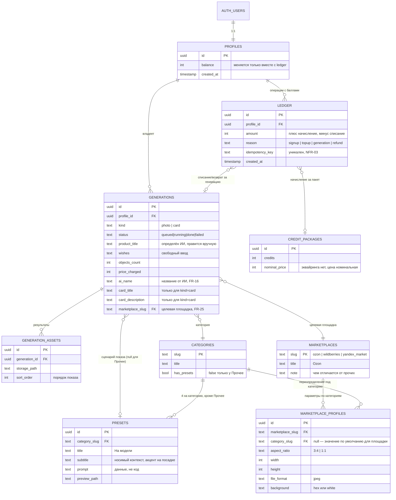
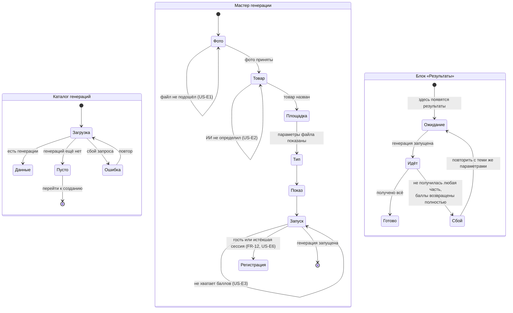
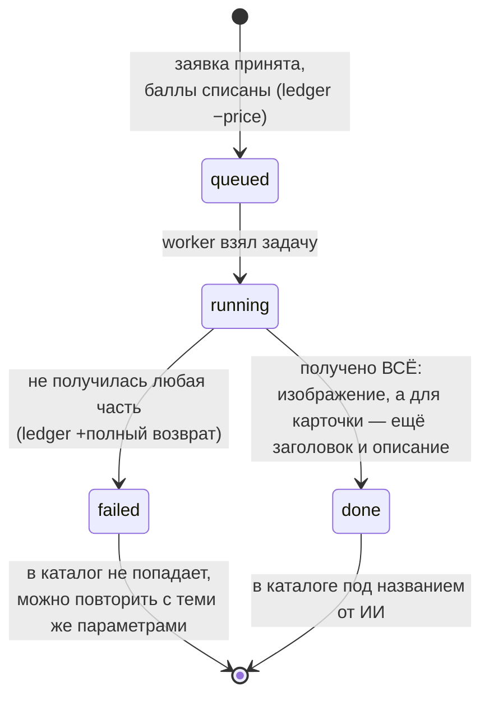

# VISUALS — визуальный артефакт проекта

Status: DRAFT (черновик интейка от 2026-08-26) · Слой: **как это выглядит и как связано**

> ## ⚠ Правило единственности — читать до правки
>
> **Это единственный визуальный артефакт проекта.** Все схемы, диаграммы, скриншоты
> референсов и макеты живут здесь и больше нигде.
>
> - Файл **переписывается на месте**. Файлов `VISUALS_v2.md`, `VISUALS_old.md`,
>   `СХЕМЫ.md`, `SPEC_диаграммы.md` **не существует** и заводить их запрещено.
> - `TZ.md` и `SPEC.md` на визуалы **ссылаются** (`[V-03](VISUALS.md#v-03)`), а не копируют их.
> - **Правка визуала обновляет и визуал, и все ссылающиеся на него пункты** — в одном
>   изменении. Список ссылающихся держится в реестре ниже.
> - У каждого визуала **стабильный ID `V-NN`**. ID не переиспользуется после удаления.
> - **Схемы — текстом (Mermaid), не картинкой.** Картинками остаётся только то, что картинкой
>   и является: скриншоты, фото, макеты.
>
> Обоснование — [ADR-0004](adr/0004-single-visual-artifact.md).

**Как адресовать правку:** «на схеме V-03 добавь шаг X» / «референс V-05 больше не берём».

---

## Реестр визуалов

| ID | Название | Тип | Что показывает | Ссылаются |
| --- | --- | --- | --- | --- |
| [V-01](#v-01) | Главный сценарий | Mermaid flowchart | Путь продавца от загрузки фото до скачанных материалов | `TZ.md` US-01 |
| [V-02](#v-02) | Контекст системы | Mermaid (C4 L1) | Merch Kit и внешний мир | `SPEC.md` §1 |
| [V-03](#v-03) | Контейнеры | Mermaid (C4 L2) | Из каких частей состоит система | `SPEC.md` §1, §3 |
| [V-04](#v-04) | Модель данных | Mermaid ER | Сущности и связи | `TZ.md` §7, `SPEC.md` §4 |
| [V-05](#v-05) | Референс aidentika.com | Скриншоты + разбор | Что берём и что не берём из референса | `TZ.md` §1, §5.1, `SPEC.md` §9 |
| [V-06](#v-06) | Состояния экранов | Mermaid state | Загрузка · пусто · ошибка | `TZ.md` §4 |
| [V-07](#v-07) | Жизненный цикл генерации | Mermaid state | Статусы генерации и движение баллов | `SPEC.md` §1, `TZ.md` US-E4 |
| [V-08](#v-08) | Дизайн-канвас | Артефакт Claude Design | Утверждённые макеты экранов, приоритет — десктоп | `00_GENERAL_PLAN.md` «Дизайн» |
| [V-09](#v-09) | Калькулятор экономики | Интерактивная страница | Себестоимость, маржа пакетов, безубыточность, вендоры; утверждение цифр и журнал операций | `TZ.md` §11, `UNIT_ECONOMICS.md` |
| [V-10](#v-10) | Референсы карточек | Изображения | Как выглядит карточка маркетплейса, которую генерирует сервис; основа системного промпта | `TZ.md` §11, FR-07, `CONTEXT.md` «Тип генерации» |

---

## V-01 — Главный сценарий

Что показывает: путь продавца (`TZ.md` §2) через главный сценарий US-01.

## V-02 — Контекст системы (C4 уровень 1)

## V-03 — Контейнеры (C4 уровень 2)

> **Красная линия на схеме:** от `UI` к `AIP` стрелки нет и быть не может — ключ провайдера
> в браузер не попадает (`SPEC.md` §3, `TZ.md` §8).

## V-04 — Модель данных

> **`marketplace_profiles` — справочник, а не код** (как `presets`): параметры конечного
> изображения правятся без релиза. Строка с `category_slug = null` — значение по умолчанию
> для площадки, строка с категорией его переопределяет: так выражаются серый фон Ozon для
> «Одежда и обувь» и квадрат 1 : 1 для «Еда и напитки». Значения и источники —
> `TZ.md` §5.2 и
> [`../planning/reference/MARKETPLACE_IMAGE_REQUIREMENTS.md`](../planning/reference/MARKETPLACE_IMAGE_REQUIREMENTS.md).

> TODO(пользователь): поля `credit_packages.credits` и прайс генерации пока без значений —
> см. открытые вопросы `TZ.md` §11.

## V-05 — Референс aidentika.com

> Каждый референс — с разбором. «Хочу как у них» без разбора превращается в копирование
> случайных решений, включая их ошибки.

### V-05.1 — Стартовый экран: три колонки

- **Что это:** [app.aidentika.com](https://www.aidentika.com/), скриншот из ТЗ заказчика
- **Скриншот:** ``

- **Берём:**
  - трёхшаговую раскладку с явной нумерацией: **01 Ваш товар** → **02 Настройте генерацию**
    → **03 Результаты**. Пользователь видит весь путь целиком, а не узнаёт о следующем шаге
    после нажатия;
  - зону drag-and-drop как главный вход («Перетащите фото сюда · или выберите файл»);
  - подсказку про несколько ракурсов («До 4 фото товара с разных сторон») — из неё взято
    предположение о 4 фото, см. открытый вопрос в `TZ.md` §11;
  - пустое состояние правой колонки с текстом «Здесь появятся результаты после генерации»
    вместо пустоты (`TZ.md` §4, [V-06](#v-06)).
- **Не берём:**
  - вкладку **«Видео»** в «Тип контента» — по нашему ТЗ типов ровно два, «фото» и
    «карточка» (`TZ.md` §3, не-scope);
  - конкретный визуальный стиль (салатовый акцент, шрифты) — фирменный стиль наш: зелёная
    тема shadcn, зафиксирована в [V-08](#v-08) (решено 2026-08-27 по референсу пользователя
    `github.com/leoMirandaa/shadcn-landing-page`).

### V-05.2 — Распознавание и сценарии показа

- **Скриншот:** ``

- **Берём:**
  - блок **«Это»**: распознанное наименование («Куртка») отдельным полем + категория
    («Одежда и обувь») выпадающим списком — оба **редактируемые** (обоснование FR-05);
  - счётчик загруженных фото «1 из 4 · очистить»;
  - карточки сценариев показа: **превью + название + короткое пояснение** — именно
    пояснение делает выбор осмысленным для того, кто не умеет писать промпты. Отсюда взяты
    четыре сценария категории «Одежда и обувь» (`TZ.md` §5.1):
    «На модели» — носимый контекст, акцент на посадке ·
    «Как в магазине» — на вешалке или подставке ·
    «Раскладка сверху» — вид строго сверху ·
    «Каталог (студийно)» — чистый объект на нейтральном фоне.
- **Не берём:** ничего дополнительно.

> TODO(пользователь): нужны такие же формулировки для остальных пяти категорий со
> сценариями (Аксессуары, Еда и напитки, Косметика и уход, Гаджеты и техника, Дом и мебель)
> — итого 20 недостающих из 24.

## V-06 — Состояния экранов

> **Шагов в мастере шесть:** фото → товар → площадка → тип → как показать → запуск
> (решение пользователя 2026-08-29, заход D2). Шага «количество объектов» среди них нет:
> потолок в 1 объект за генерацию (`TZ.md` §11) превращает выбор в контрол из одного
> варианта, поэтому цена показана сразу. Шаг «Площадка» — выбор маркетплейса (FR-25),
> он определяет параметры конечного изображения.
>
> **Промежуточного исхода у генерации нет** (решение пользователя 2026-08-29): либо всё,
> либо ничего. Не получилось изображение — сбой; получилось изображение, но не получились
> заголовок и описание карточки — тоже сбой. В обоих случаях возврат полный, пользователь не
> получает ничего, а получает возможность повторить генерацию с теми же параметрами.
> Состояние «Частично» и сценарий US-E5 сняты, случай поглощён US-E4.

## V-07 — Жизненный цикл генерации и движение баллов

Что показывает: как статус генерации связан со списанием и возвратом баллов
(`SPEC.md` §1, §3; `TZ.md` NFR-03, US-E4).

> Каждая запись в `ledger` несёт ключ идемпотентности: повторная доставка одного события не
> двигает баланс дважды (NFR-03).

> **Исходов ровно два** (решение пользователя 2026-08-29). Промежуточного `partial` нет:
> частичный результат не отдаётся и частично не оплачивается. Изображение получено, а тексты
> карточки нет — это `failed` с полным возвратом, ровно как если бы провайдер не ответил
> совсем. Мотив: половина карточки продавцу не нужна, а объяснять ему, за что списано 50 из
> 55, дороже, чем просто вернуть всё и дать повторить.

---

## V-08 — Дизайн-канвас

**Статус: два захода на одном канвасе, 29 артбордов.**
Ссылка: **<https://claude.ai/code/artifact/aa97527f-5cae-43f9-90bb-64faf91ee1e3>**
(«Merch Kit — экраны продукта»). Заходы и правила — раздел «Дизайн» в
[`../planning/reference/00_GENERAL_PLAN.md`](../planning/reference/00_GENERAL_PLAN.md).

| Страница канваса | Заход | Артбордов | Веха | Статус |
| --- | --- | --- | --- | --- |
| «Аккаунт — D1» | D1 | 12 | M2 | **Утверждены 2026-08-27** |
| «Генерация — D2» | D2 | 17 | M4 | **Утверждены 2026-08-29** |

> **Артефакт переиздан на тот же URL 2026-08-29** (версия `d2-generation`): по ссылке лежат
> обе страницы, 29 артбордов, название «Merch Kit — экраны продукта». Перед переизданием
> опубликованная версия выгружена (`--extract`) и сверена с исходниками: все 12 артбордов D1
> совпали до байта — в редакторе никто ничего не менял. Сохранение осталось включённым
> (декларация `self` + `downloads` перенесена платформой без изменений).
>
> Днём ранее в той же дате попытка падала — `artifact content fetch failed (network error)`,
> затем `HTTP 403` на чтение того же артефакта. Отказ оказался **временным**: повтор тем же
> вызовом прошёл без единой правки. Если повторится — повторять вызов, а **второй артефакт
> не заводить**: это сломает [ADR-0004](adr/0004-single-visual-artifact.md) и решение
> пользователя «вторая страница того же канваса». Страница пересобирается из репозитория
> одной командой (см. «Как переиздать канвас» ниже).
>
> **Артборды D2 утверждены пользователем 2026-08-29.** С этого момента экранные шаги
> вехи M4 пишутся по макетам: расхождение вёрстки с артбордом — дефект вёрстки, а не
> «дизайн поменялся». Формулировки 24 сценариев показа на артбордах временные (открытый
> вопрос ТЗ §11) — их правка макеты не переутверждает.

Обе страницы живут в **одном** артефакте по одной ссылке — курс
[ADR-0004](adr/0004-single-visual-artifact.md) на единственный визуальный артефакт;
`pages` в `canvas.json` для этого и заведены (решение пользователя 2026-08-29). Тогда же
артефакт переименован из «Merch Kit — экраны аккаунта»: аккаунтом он больше не исчерпывается.

**Контраст (2026-08-28):** исходники артбордов перерисованы под токены кода, проходящие
WCAG 2.1 AA (`primary #15803D`, `destructive #DC2626`, текстовый серый `#52525B`; `#16A34A`
остался нетекстовым акцентом). Артефакт переиздан на тот же URL 2026-08-28 (версия
`aa-contrast`); заметка «Палитра» на канвасе обновлена под новые значения.

**Копирайт стартовых баллов (2026-08-28):** артборды обещали «20 стартовых баллов», хотя
бейдж в шапке, плитка баланса и строка журнала на тех же артбордах показывали утверждённые
`120`, а формулировка «одна пробная генерация из двух объектов» противоречила решению
«максимум 1 объект за генерацию» ([`TZ.md`](TZ.md) §11). Исходники исправлены на «120
стартовых баллов — это две пробные генерации».

**Артборд «профиль до подтверждения» выведен (2026-08-28).** Он показывал состояние «вошёл,
но email не подтверждён», которого у встроенного подтверждения Supabase не существует:
до перехода по ссылке вход отклоняется целиком. Решение и замеры —
[ADR-0008](adr/0008-email-confirmation-gates-sign-in.md). Исходник и строка в `canvas.json`
удалены, `Profile` переехал на его место в третьем ряду.

**Артефакт переиздан на тот же URL 2026-08-28** (версия `120-credits-adr-0008`) — обе правки
выше в нём есть.

**Подсказка про состав пароля убрана (2026-08-28).** С артборда `ResetNewPassword` снята
строка «Минимум 8 символов, буквы и цифры»: она обещала правило состава пароля, которого
система не проверяет (решение пользователя 2026-08-28 — правило рассмотреть отдельно, см.
«Дальнейшие апгрейды» в [`00_GENERAL_PLAN.md`](../planning/reference/00_GENERAL_PLAN.md)).
**Артефакт переиздан на тот же URL 2026-08-28** (проверено на версии `1787913721-aa33`). Перед
переизданием опубликованная версия выгружена (`--extract`) и сверена с исходниками:
расхождений, кроме этой правки, нет — в редакторе никто ничего не менял.

**Удаление аккаунта добавлено на артборд `Profile` (2026-08-28).** Веха M3 завела кнопку
удаления в панели «Аккаунт» по 152-ФЗ (право отозвать согласие на обработку данных); в
утверждённом заходе D1 такого элемента не было — требования в ТЗ нет, и рисовать его было не с
чего. Артборд приведён к коду: в `accountPanel()` в `gen.mjs` добавлены разделитель и кнопка
`Удалить аккаунт` (ghost с текстом `destructive #DC2626`). **Артефакт переиздан на тот же URL
2026-08-28** (версия `delete-account`). Перед переизданием опубликованная версия выгружена
(`--extract`) и сверена с исходниками: все 12 артбордов совпали до байта — в редакторе никто
ничего не менял. Двухшагового подтверждения удаления на артборде нет: это состояние экрана, а
не отдельный макет, и отдельного артборда под него заход D1 не заводил.

> **Как переиздать канвас.** Сборка — `seed-canvas.mjs` из скила `design` по файлам
> `design/d1-account/` **и** `design/d2-generation/` с общим манифестом
> [`design/canvas.json`](design/canvas.json) — он один на обе страницы и потому лежит уровнем
> выше папок заходов (собранный канвас ~2,5 МБ в репозиторий не кладём), публикация — на
> тот же URL с `contract: "0.1.31"` и **без** `capabilities`: в артефакте уже сохранены
> `self` + `downloads`, передача своего набора может отобрать сохранение у всех. Эмодзи
> вкладки — 🎨, менять его не надо. Предпубликационная проверка артефакта иногда отвечает
> сетевой ошибкой (в сессии 2026-08-28 — `HTTP 403`); лечится повтором той же публикации,
> у нас это заняло три попытки.

Канвас Claude Design, опубликованный артефактом: несколько артбордов на одном холсте, правка
элементов прямо в артефакте, комментарии и версии. **Это место, где макеты утверждаются** —
не переписка и не скриншоты в чате.

- **Приоритет — десктоп.** Десктопные артборды обязательны для каждого экрана. Мобильные
  рисуются только там, где раскладка принципиально другая, а не сжимается: мастер генерации
  и каталог (NFR-09).
- **D1 (перед M2) — страница «Аккаунт — D1»:** вход (+ неверная пара) · регистрация
  (+ ошибки полей) · «подтвердите email» · восстановление пароля (запрос · нейтральный ответ
  US-E7 · новый пароль) · профиль · пакеты пополнения · состояния каталога
  (загрузка · пусто · ошибка). **Утверждены 2026-08-27.**
- **Палитра канваса:** зелёная тема shadcn (`--primary: 142.1 76.2% 36.3%` → `#16A34A`,
  `--border #E4E4E7`, `--muted #F4F4F5`, `--destructive #EF4444`, радиус `0.5rem`), контролы
  40 px. Источник — референс пользователя `github.com/leoMirandaa/shadcn-landing-page`.
- **Цифры на артбордах утверждены** пользователем 2026-08-27 в [V-09](#v-09): N = 120
  стартовых баллов, 50 баллов за объект, пакеты 300 / 1 000 / 3 000 по 390 / 1 090 / 2 030 ₽.
  Расчётная база — [`UNIT_ECONOMICS.md`](../planning/reference/UNIT_ECONOMICS.md) §8,
  перенесены в [`TZ.md`](TZ.md) §11. Меняются цифры — правятся все три места в одном изменении.
- **D2 (перед M4) — страница «Генерация — D2», 17 артбордов (2026-08-29):** мастер из шести
  шагов — фото (пусто · загружены · US-E1) · товар (распознан · US-E2) · **площадка (FR-25)** ·
  тип · как показать · запуск (цена · US-E3 · перехват гостя FR-12/US-E6) · «идёт генерация»
  (NFR-02) · результаты (готово · сбой US-E4) · каталог с данными (FR-01) ·
  мобильные мастер и каталог. **Ждут утверждения пользователем — до него веха M4 не стартует.**
  - **Шаг «Площадка» (FR-25)** — решение пользователя 2026-08-29: Ozon · Wildberries ·
    Яндекс Маркет, и выбор тянет за собой все параметры конечного изображения. На артборде
    видны и сами параметры («Что получится на выходе»), и то, что они зависят от пары
    «маркетплейс × категория». Блок с параметрами повторён на «Запуске» и на «Готово»:
    пользователь видит, за какой файл платит, до списания. Требования и источники —
    [`../planning/reference/MARKETPLACE_IMAGE_REQUIREMENTS.md`](../planning/reference/MARKETPLACE_IMAGE_REQUIREMENTS.md).
  - **Логотипов маркетплейсов на артбордах нет** — чужие товарные знаки; названия текстом.
  - **`#F2F3F5` на артбордах — не новый токен палитры,** а цитата требования Ozon к фону для
    категории «Одежда и обувь», показанная образцом рядом со значением. В интерфейсных
    элементах не используется; проверка «новых цветов не заведено» это учитывает.
  - **Шага «количество объектов» (FR-10) на артбордах нет:** потолок в 1 объект (`TZ.md` §11)
    оставляет контрол из одного варианта, а неактивный контрол — шум для клавиатуры и
    скринридера (NFR-07). Цена показана сразу, пояснение про один объект — текстом.
  - **«Текстовое описание товара»** (уточнение пользователя 2026-08-29) — поле на шаге
    «Товар» рядом с распознанными наименованием и категорией, а не отдельный шаг: оттуда
    карточка берёт выноса про свойства и размерный ряд ([V-10](#v-10)). Пожелания FR-09
    остались отдельным полем на шаге «Как показать» — они про подачу, а не про товар.
  - **Форматы файлов и предел размера на входе (US-E1): JPG, PNG, WebP, HEIC до 10 МБ** —
    решение пользователя 2026-08-29 брать их от требований маркетплейсов, а не выдумывать.
    Предел 10 МБ совпал у всех трёх площадок, набор форматов — их пересечение
    ([`TZ.md`](TZ.md) §11).
- **Соответствие:** [V-06](#v-06) остаётся текстовым перечнем состояний экранов и обязан
  соответствовать канвасу. Расходятся — правятся оба, в одном изменении.

> **Про Figma:** канвас экспортируется в PNG и PDF. Редактируемого Figma-файла со слоями он
> не даёт — экспорт попадёт в Figma картинкой, а не макетом. Источник правды по макетам —
> сам канвас.

> **Как править канвас:** артборды правятся в самом артефакте (клик по элементу, панель
> свойств, `Save` публикует новую версию для всех). Исходники артбордов лежат в
> [`design/d1-account/`](design/d1-account/) и [`design/d2-generation/`](design/d2-generation/),
> общая раскладка — [`design/canvas.json`](design/canvas.json); оттуда канвас пересобирается; после правки
> в артефакте они выгружаются обратно (`--extract`, процедура скила `design`). При
> расхождении прав артефакт: в нём макеты утверждаются.

**Страница «Аккаунт — D1» утверждена пользователем 2026-08-27** — веха M2 была разблокирована ею.
**Страница «Генерация — D2» утверждения ждёт** — до него веха M4 не стартует.

## V-09 — Калькулятор экономики

**Статус: опубликован 2026-08-27.**
Ссылка: **<https://claude.ai/code/artifact/856c5cdd-0bfd-4ef7-91d9-19e76a2e82b7>**
(«Экономика Merch Kit»). Исходник — [`design/economics/ekonomika-merch-kit.html`](design/economics/ekonomika-merch-kit.html),
открывается локально двойным кликом.

Интерактивная страница: подставляются вендор, параметры генерации, цена в баллах, состав
пакетов, постоянные и единоразовые расходы, желаемая прибыль — и пересчитываются
себестоимость объекта и балла, маржа пакетов, точка безубыточности, объём под цель и срок
окупаемости. Графика: структура себестоимости, сравнение вендоров, кривая безубыточности,
отчёт по статьям, схема движения денег и баллов.

- **Каждый параметр снабжён раскрывающимся пояснением** «зачем этот параметр» + что значат
  его меньшее и большее значения — читается без знания расчётной модели.
- **Кнопка «Утвердить цифры»** — акт утверждения: пишет решение и пошаговую арифметику в
  журнал операций внутри артефакта. Перенос в `TZ.md` §11 делает Claude Code по команде
  «синхронизируй экономику из артефакта» — страница файлы репозитория не правит.
- **Журнал операций** выгружается JSON и CSV — по нему сверяется математика.
- Расчётная база — [`UNIT_ECONOMICS.md`](../planning/reference/UNIT_ECONOMICS.md); прайсы
  вендоров и допущения перечислены на самой странице со ссылками на источники.
- Вендор продукта этой страницей **не выбирается** ([ADR-0005](adr/0005-ai-provider-abstraction.md)):
  вендоры в ней — варианты расчёта.

## V-10 — Референсы карточек маркетплейса

Три примера карточек, присланные пользователем 2026-08-29 — по ним видно, что генерирует
сервис при типе «карточка», и по ним же будет составлен системный промпт (M4, M5).

Файлы: [`assets/cardsforsysprompt/`](assets/cardsforsysprompt/) — верхняя одежда · женская
одежда · спортивная футболка.

**Главное, что они показывают: карточка — ОДНО изображение, а не набор слайдов.** Формулировка
«карусель изображений» жила в `TZ.md`, `CONTEXT.md`, README и генплане с интейка и была
неверной; исправлена в том же изменении, открытый вопрос §11 закрыт.

Общее в трёх референсах — то, что и должен воспроизводить системный промпт:

- **вертикальный кадр** около 3:4, товар на модели занимает правые две трети;
- **вёрстка поверх фото слева**: крупное название товара, под ним подзаголовок-уточнение
  («мужская», «майка · женское», «спортивная»);
- **два-три выноса про свойства** — короткая пара «жирное слово + пояснение», иногда с
  иконкой или номером;
- **размерный ряд** отдельным блоком, крупно;
- необязательное: логотип бренда сверху, плашка навигации маркетплейса, блок описания мелким
  шрифтом внизу.

Что из этого войдёт в промпт, а что останется на усмотрение провайдера — решается на M4 при
написании заглушки и уточняется на M5. Подкладывать сами эти изображения провайдеру как
образцы — отдельное предложение, оно записано в «Дальнейшие апгрейды» генплана.

## Изображения

Бинарники — в [`assets/`](assets/), имя файла привязано к ID визуала:
`v-05-1-<slug>.jpg`. Так по имени файла видно, к какой схеме он относится. Исключение —
[`assets/cardsforsysprompt/`](assets/cardsforsysprompt/) (V-10): это набор референсов, он
пополняется пользователем, и имена в нём говорящие сами по себе.

Форматы: PNG/JPG для растра, SVG для векторных макетов. Крупные исходники (Figma, PSD) в
репозиторий не кладутся — вместо них ссылка + экспортированный скриншот.

## Исходники графических артефактов

Артборды, интерактивные страницы и прочая графика сложнее схемы — в
[`design/`](design/README.md), по папке на артефакт; реестр и адресация остаются здесь.
Правило и устройство папки — [`design/README.md`](design/README.md).

## Как править

1. Найти визуал по ID (`V-NN`).
2. Поправить его **здесь**, на месте. Не создавать копию, не заводить второй файл.
3. Обновить строку реестра, если изменилось назначение схемы.
4. Пройти по колонке «Ссылаются» и синхронизировать пункты в `TZ.md` / `SPEC.md` —
   **в том же изменении**.
5. Если правка меняет требование, а не только картинку, — правится и требование в `TZ.md`.

## Связанные документы

| Документ | Что там |
| --- | --- |
| [`TZ.md`](TZ.md) | Требования — что и зачем |
| [`SPEC.md`](SPEC.md) | Спецификация — как устроено |
| [`adr/0004-single-visual-artifact.md`](adr/0004-single-visual-artifact.md) | Почему визуальный слой — один файл |
